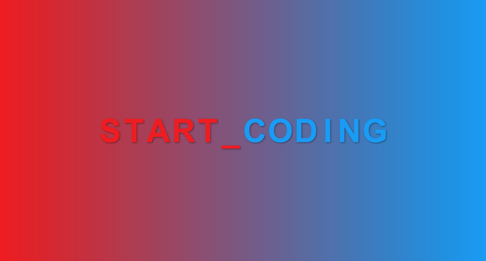

# web-dev-setup

### Prerequisites
- Install node.js <https://nodejs.org>

### Getting started
Run the following commands from the root folder of your project:
1. `npm i` to install all dependencies.
2. `npm start` to run the example on <http://localhost:3000>
